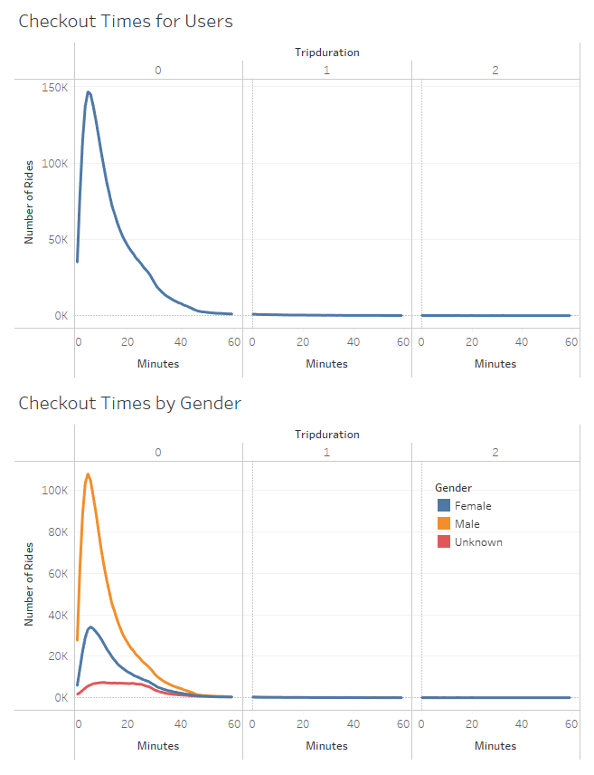
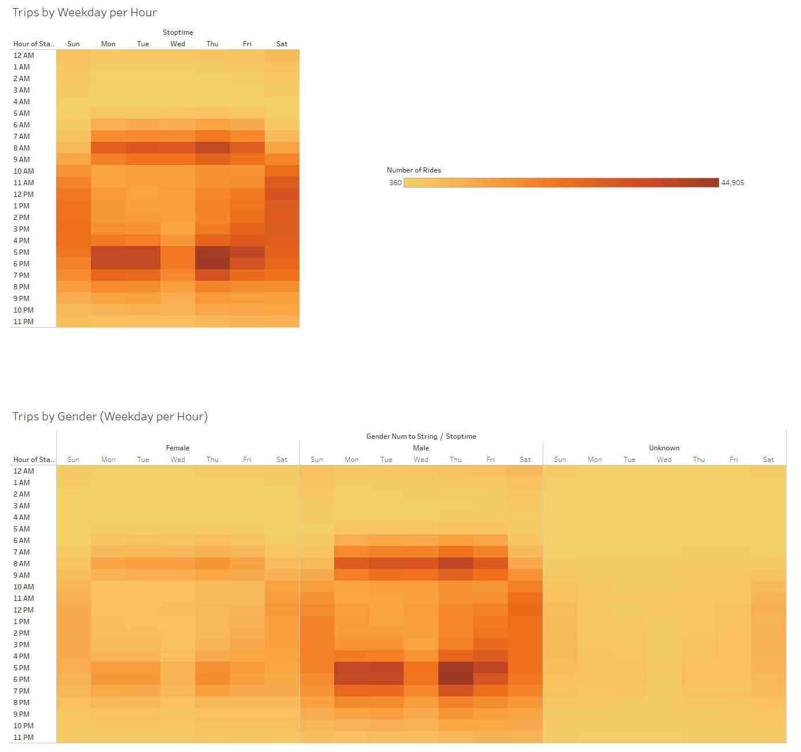
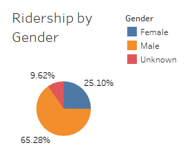
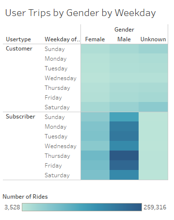
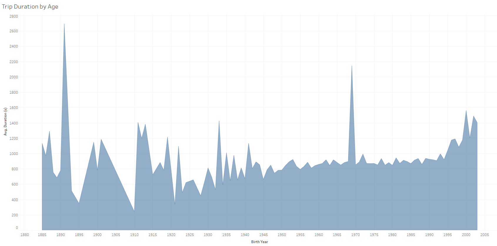

# Challenge 14 - Citi Bike Bikesharing
## Overview
The purpose of this project is to analyze Citi Bike NYC data and provide visualizations to convince investors that Des Moines would be a valuable location for a new bike-sharing program. Tableau Public was used for all visualizations.

## Results

Above is a breakdown of the count of checkout times (rounded down to nearest the minute), and the same chart broken out by gender. This shows that a significant portion of the rides are shorter than 30 minutes, for both genders. 

The charts above show the most popular hours of the day, overall and by gender.  For both genders, it can be seen that commute times are the significantly more popular during the weekdays, with relatively even daytime usage on Saturday and Sunday. 

Above, it is shown that that males represent a significant majority of the rides overall.

This chart additionally groups the user types by Subscriber (paying monthly) and Customer (paying per ride). There is significantly more bike usage by subscribers. For completely unknown reasons, the highest usage is by males on Thursdays.  They must be thirsty that day. 

Finally, the above chart shows the average duration of a trip, in seconds, by age. It's unclear why Citi Bike has any customers over the age of 100, let alone 120. Perhaps people are lying about their age.  

## Summary
Besides overall ride counts, both males and females show similar usage patterns--both in average ride duration and typical time and day of use. The hour and weekday breakdown makes it clear that the largest quantity of bikes should be made available during commute hours. Bikes should be removed for service after 10pm or before 5am, if possible. The increased usage by males may be useful for marketing and targeted advertising. Because the data for Birth Year appears so erratic, it's not recommended that it is used for any significant analyis.  Perhaps the method for collecting the information from users was unreliable.

If we were to make two more visualizations, they would be:
- A map of start/end stations (with marker radiuses representing the count) with other public transit options, like bike or subway, to help determine likely hot spots.
- A map of start/end stations (with marker radiuses representing the count) with a topological overlay to determine whether hills play an important factor in bike usage. 

## Link to Tableau
[Tableau Public Link](https://public.tableau.com/views/Module14Challenge-NYCCitiBike/CheckoutTimesforUsers?:language=en-US&publish=yes&:display_count=n&:origin=viz_share_link)